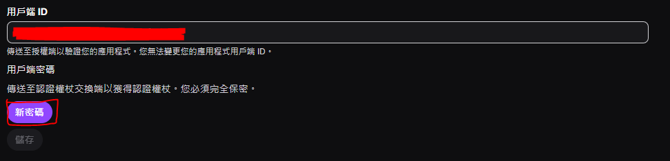
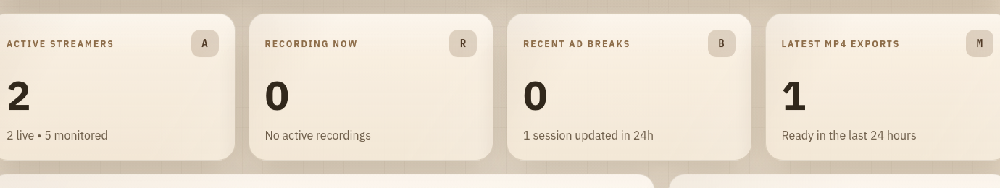
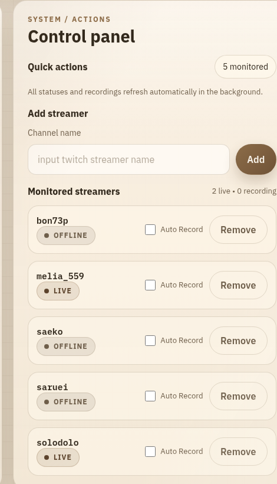
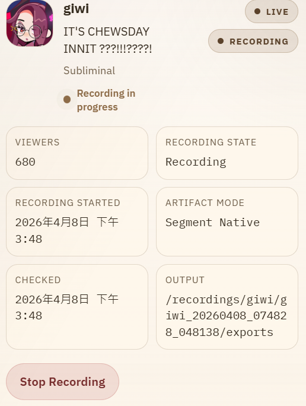
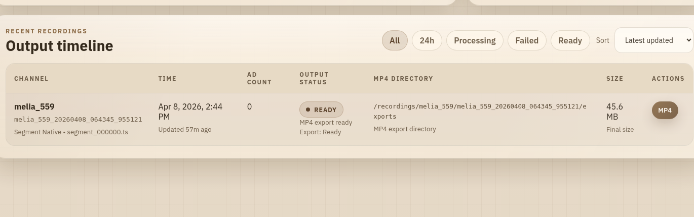

# Twitch Recorder

English users: see [README_EN.md](./README_EN.md).

這個專案可以幫你自動監看 Twitch 主播，只要對方一開播，就自動開始錄影，讓你不用一直自己盯著直播時間。

適合這些使用情境：

- 自動保存特定 Twitch 主播直播內容
- 同時追蹤多位主播
- 用瀏覽器就能管理監看名單
- 不想手動查開播、手動按錄影的人
- vod會過期，或是開訂閱會員才能看vod

## 可以做到什麼

- 新增你想監看的 Twitch 主播
- 從管理畫面刪除主播
- 針對每位主播個別切換是否允許自動錄影（白名單）
- 自動檢查對方有沒有開播
- 開播後依設定延遲幾秒再自動開始錄影，避開開場 `Preparing your stream`
- 直播結束後保留短暫寬限期，再自動停止錄影
- 直播中可手動開始或停止錄影
- 查看目前誰正在直播、誰正在錄影，以及目前錄影狀態
- 查看最近錄好的影片檔案、clean MP4 自動轉檔狀態，以及 MP4 所在目錄

## 使用前要準備什麼

- 一台有安裝 Docker 的電腦
- 一組 Twitch 提供的應用程式金鑰
  - `TWITCH_CLIENT_ID`
  - `TWITCH_CLIENT_SECRET`

你可以把它理解成「讓這個工具有權限去查 Twitch 公開直播資訊」的通行證。沒有這兩個值，系統就不知道要用哪個 Twitch 應用程式去查資料。

如果你還沒有這組資料，可以照下面方式申請：

1. 登入你的 Twitch 帳號
2. 前往 Twitch Developer Console
3. 建立一個新的應用程式
4. 建立完成後，你會拿到 `Client ID`(用戶名端ID)
5. 接著再按新密碼按鈕，產生 `Client Secret`(用戶名端密碼)
6. 把這兩個值填進 `.env` 裡對應的位置



如果申請頁面要求填 `OAuth Redirect URL`，你可以先填一個本機網址，例如 `http://localhost`。這個專案主要是拿來查直播資訊，不需要做複雜登入流程。

## 快速開始

1. 在專案根目錄建立 `.env` 檔案

把下面內容填進去：

```env
TWITCH_CLIENT_ID=你的_client_id
TWITCH_CLIENT_SECRET=你的_client_secret
TWITCH_USER_OAUTH_TOKEN=
TWITCH_USER_LOGIN=
MAX_CONCURRENT_STREAMERS=3
POLL_INTERVAL_SECONDS=30
OFFLINE_GRACE_PERIOD_SECONDS=20
RECORDING_START_DELAY_SECONDS=25
RECORDINGS_PATH=/recordings
CONFIG_PATH=/config
ALLOWED_ORIGINS=http://localhost:3000,http://127.0.0.1:3000
```

可選參數（不填也可運作）：

- `TWITCH_USER_OAUTH_TOKEN`：使用者 OAuth Token，用於「登入態錄影」以最佳努力降低廣告與開場等待畫面
- `TWITCH_USER_LOGIN`：可選，通常填 Twitch 帳號 login；未填時系統會以 token 情境盡力處理
- `RECORDING_START_DELAY_SECONDS`：主播開播後延遲幾秒才啟動錄影（預設 25 秒）

2. 啟動專案

```bash
docker compose up -d --build
```

3. 打開瀏覽器

- 管理頁面：`http://localhost:3000`

## 平常怎麼使用

1. 打開管理頁面
2. 輸入你想監看的 Twitch 主播名稱
3. 按下新增，主播會被存進監看名單
4. 在監看名單可切換每位主播 `Auto Record`，關閉代表只監看不自動錄影
5. 系統會依 `POLL_INTERVAL_SECONDS` 自動刷新直播狀態
6. 如果主播開播且 `Auto Record` 開啟，系統會先等待 `RECORDING_START_DELAY_SECONDS`，之後自動開始錄影
7. 你也可以在直播卡片上手動按 `Start Recording` 或 `Stop Recording`
8. 主播離線後，系統會依 `OFFLINE_GRACE_PERIOD_SECONDS` 保留寬限期再停止錄影
9. 錄好的影片與相關資料會存到專案資料夾

## 管理畫面可以看到什麼

- 頁首摘要：目前錄影中、直播中、監看中的主播數量

  

- 監看名單：主播名稱、Auto Record 狀態與操作按鈕

  

- 直播狀態卡片：頭像、直播狀態、錄影狀態、標題、分類、觀看人數

  

- Recent Recordings：最新錄影紀錄、處理狀態與輸出目錄

  

## 錄好的影片會放在哪裡

所有錄影資料都會存在專案根目錄對應的資料夾：

- `recordings/<streamer>/<recording_id>/`：單次錄影資料夾
- `recordings/<streamer>/<recording_id>/exports/`：匯出的影片檔，包含自動產生的 clean MP4
- `recordings/<streamer>/<recording_id>/recording.meta.json`：單次錄影 metadata
- `config/streamers.json`：監看主播設定（含 `enabled_for_recording`）
- `config/recordings.json`：錄影歷史索引

目前 `segment_native` 模式下，錄影結束後會自動在背景將 clean 輸出轉成 MP4。管理畫面的錄影列表會顯示：

- clean MP4 是否仍在處理中
- clean MP4 是否已完成
- clean MP4 所在的 `exports/` 目錄路徑

## 廣告緩解（Hybrid 模式）

- 未設定使用者 token：走一般模式錄影
- 有設定 `TWITCH_USER_OAUTH_TOKEN`：系統會先嘗試登入態抓流（best-effort），失敗時自動回退
- 錄影中會從 `streamlink` 的輸出訊息偵測 ad break；`timed_id3` 只作候選訊號，需局部 OCR 確認後才會採信
- `.meta.json` 會保留 `streamlink` 的 process `exit_code` 與最後 40 行 stderr，方便追查 `playlist ended`、`stream disconnected`、廣告切流等退出原因

## 常用指令

啟動：

```bash
docker compose up -d --build
```

查看執行狀態：

```bash
docker compose ps
```

查看後端日誌：

```bash
docker compose logs -f backend
```

手動刷新容器內的狀態：

```bash
curl -X POST http://localhost:8000/refresh
```

停止：

```bash
docker compose down
```
