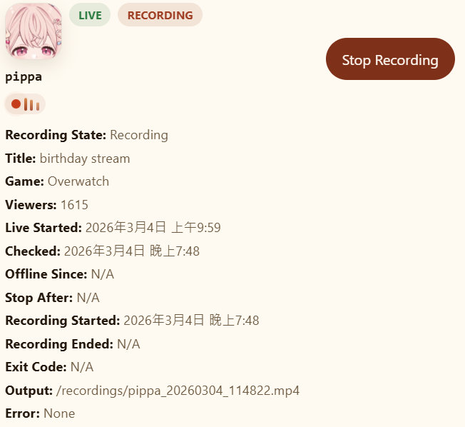

# Twitch Recorder

English users: see [README_EN.md](./README_EN.md).



這個專案可以幫你自動監看 Twitch 主播，只要對方一開播，就自動開始錄影，讓你不用一直自己盯著直播時間。

適合這些使用情境：

- 自動保存特定 Twitch 主播直播內容
- 同時追蹤多位主播
- 用瀏覽器就能管理監看名單
- 不想手動查開播、手動按錄影的人
- vod會過期，或是開訂閱會員才能看vod

## 可以做到什麼

- 新增你想監看的 Twitch 主播
- 從管理畫面刪除主播
- 自動檢查對方有沒有開播
- 開播後依設定延遲幾秒再自動開始錄影，避開開場 `Preparing your stream`
- 直播結束後保留短暫寬限期，再自動停止錄影
- 直播中可手動開始或停止錄影
- 查看目前誰正在直播、誰正在錄影，以及目前錄影狀態
- 查看最近錄好的影片檔案與 watchable 後處理狀態
- 廣告緩解流程：可選「登入態錄影」最佳努力抓流 + 廣告段落偵測 + watchable 後處理

## 使用前要準備什麼

- 一台有安裝 Docker 的電腦
- 一組 Twitch 提供的應用程式金鑰
  - `TWITCH_CLIENT_ID`
  - `TWITCH_CLIENT_SECRET`

你可以把它理解成「讓這個工具有權限去查 Twitch 公開直播資訊」的通行證。沒有這兩個值，系統就不知道要用哪個 Twitch 應用程式去查資料。

如果你還沒有這組資料，可以照下面方式申請：

1. 登入你的 Twitch 帳號
2. 前往 Twitch Developer Console
3. 建立一個新的應用程式
4. 建立完成後，你會拿到 `Client ID`(用戶名端ID)
5. 接著再按新密碼按鈕，產生 `Client Secret`(用戶名端密碼)
6. 把這兩個值填進 `.env` 裡對應的位置


如果申請頁面要求填 `OAuth Redirect URL`，你可以先填一個本機網址，例如 `http://localhost`。這個專案主要是拿來查直播資訊，不需要做複雜登入流程。

## 快速開始

1. 在專案根目錄建立 `.env` 檔案

把下面內容填進去：

```env
TWITCH_CLIENT_ID=你的_client_id
TWITCH_CLIENT_SECRET=你的_client_secret
TWITCH_USER_OAUTH_TOKEN=
TWITCH_USER_LOGIN=
MAX_CONCURRENT_STREAMERS=3
POLL_INTERVAL_SECONDS=30
OFFLINE_GRACE_PERIOD_SECONDS=20
RECORDING_START_DELAY_SECONDS=25
WATCHABLE_TRIM_START_SECONDS=0
RECORDING_RAW_CONTAINER=ts
DELETE_RAW_ON_SUCCESS=true
TWITCH_API_BATCH_SIZE=100
TWITCH_API_MIN_REQUEST_INTERVAL_SECONDS=0.2
TWITCH_API_MAX_RETRIES=3
TWITCH_API_BASE_BACKOFF_SECONDS=0.5
TWITCH_API_MAX_BACKOFF_SECONDS=8.0
TWITCH_API_RETRY_JITTER_RATIO=0.2
RECORDINGS_PATH=/recordings
CONFIG_PATH=/config
ALLOWED_ORIGINS=http://localhost:3000,http://127.0.0.1:3000
```

可選參數（不填也可運作）：

- `TWITCH_USER_OAUTH_TOKEN`：使用者 OAuth Token，用於「登入態錄影」以最佳努力降低廣告與開場等待畫面
- `TWITCH_USER_LOGIN`：可選，通常填 Twitch 帳號 login；未填時系統會以 token 情境盡力處理
- `RECORDING_START_DELAY_SECONDS`：主播開播後延遲幾秒才啟動錄影（預設 25 秒），用來避開開場 `Preparing your stream` 畫面，這是主方案
- `WATCHABLE_TRIM_START_SECONDS`：watchable 檔案固定裁掉開頭秒數（預設 0 秒）；當主方案仍有殘留時再作為 fallback 調整（常見可設 `10~20`）
- `RECORDING_RAW_CONTAINER`：原始錄影容器（預設 `ts`）；若要回到舊行為可改成 `mp4`
- `DELETE_RAW_ON_SUCCESS`：watchable 成功後是否刪除原始檔（預設 `true`）
- `TWITCH_API_BATCH_SIZE`：每次 Helix 查詢最多送多少個 login（上限 100）
- `TWITCH_API_MIN_REQUEST_INTERVAL_SECONDS`：每次 Twitch 請求之間最小間隔（秒）
- `TWITCH_API_MAX_RETRIES`：429 / 5xx / 網路錯誤的最大重試次數
- `TWITCH_API_BASE_BACKOFF_SECONDS` / `TWITCH_API_MAX_BACKOFF_SECONDS`：重試退避時間範圍
- `TWITCH_API_RETRY_JITTER_RATIO`：重試抖動比例，避免固定節奏重打 API

2. 啟動專案

```bash
docker compose up -d --build
```

3. 打開瀏覽器

- 管理頁面：`http://localhost:3000`

## 平常怎麼使用

1. 打開管理頁面
2. 輸入你想監看的 Twitch 主播名稱
3. 按下新增，主播會被存進監看名單
4. 系統會依 `POLL_INTERVAL_SECONDS` 自動刷新直播狀態
5. 如果主播開播，系統會先等待 `RECORDING_START_DELAY_SECONDS`，之後自動開始錄影
6. 你也可以在直播卡片上手動按 `Start Recording` 或 `Stop Recording`
7. 主播離線後，系統會依 `OFFLINE_GRACE_PERIOD_SECONDS` 保留寬限期再停止錄影
8. 錄好的原始檔、watchable 檔和 metadata 會存到專案資料夾

## 管理畫面可以看到什麼

- 頁首摘要：目前錄影中、直播中、監看中的主播數量
- 監看名單：主播名稱與移除按鈕
- 直播卡片：頭像、直播狀態、錄影狀態、標題、分類、觀看人數
- 錄影細節：直播開始時間、最後檢查時間、離線時間、停止截止時間、輸出路徑、錯誤訊息
- 錄影列表：最新 5 筆錄影的頻道、原始檔名、watchable 狀態、最後修改時間

## 錄好的影片會放在哪裡

所有錄影資料都會存在專案根目錄對應的資料夾：

- `recordings/<channel>_<timestamp>.ts`：原始錄影檔（預設）
- `recordings/<channel>_<timestamp>.watchable.mp4`：可拖曳、可播放的後處理版本
- `recordings/<channel>_<timestamp>.meta.json`：單次錄影的事件與輸出 metadata，包含 `exit_code`、`streamlink_stderr_tail`、`source_available`、`source_deleted_on_success`
- `config/streamers.json`：監看名單
- `config/recordings.json`：錄影歷史索引

## 廣告緩解（Hybrid 模式）

- 未設定使用者 token：走一般模式錄影
- 有設定 `TWITCH_USER_OAUTH_TOKEN`：系統會先嘗試登入態抓流（best-effort），失敗時自動回退
- 錄影中會從 `streamlink` 的輸出訊息偵測 ad break；`timed_id3` 只作候選訊號，需局部 OCR 確認後才會採信
- `.meta.json` 會保留 `streamlink` 的 process `exit_code` 與最後 40 行 stderr，方便追查 `playlist ended`、`stream disconnected`、廣告切流等退出原因
- 錄影結束後會產生 watchable 後處理檔案（固定 `.watchable.mp4`）：無廣告時優先走 remux / trim-copy 快路徑；只有高信心廣告區段才進入切段轉檔
- 預設在 watchable 成功後刪除 raw（`DELETE_RAW_ON_SUCCESS=true`）；若收尾失敗或 watchable 不存在，raw 會保留
- 前端錄影列表目前顯示 watchable 狀態；`/recordings` API 與 `.meta.json` 仍會保留 `ad_break_count`、`source_mode` 與 raw 可用性欄位

## 常用指令

啟動：

```bash
docker compose up -d --build
```

查看執行狀態：

```bash
docker compose ps
```

查看後端日誌：

```bash
docker compose logs -f backend
```

手動刷新容器內的狀態：

```bash
curl -X POST http://localhost:8000/refresh
```

停止：

```bash
docker compose down
```


## 已知限制與調校建議

- 原始錄影檔預設是 TS 容器（`RECORDING_RAW_CONTAINER=ts`），平常播放優先使用 `.watchable.mp4`
- watchable 版本是在錄影結束後才產生；如果錄影太短或後處理失敗，raw 會保留，但 watchable 狀態可能顯示失敗
- 若你要保留 raw 檔案做除錯，請設 `DELETE_RAW_ON_SUCCESS=false`
- 若開場仍常錄到 `Preparing your stream`，優先調高 `RECORDING_START_DELAY_SECONDS`（主方案）；若只想讓可播放版本略過開頭，再調整 `WATCHABLE_TRIM_START_SECONDS`（fallback）
