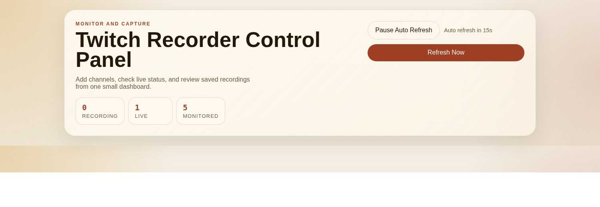
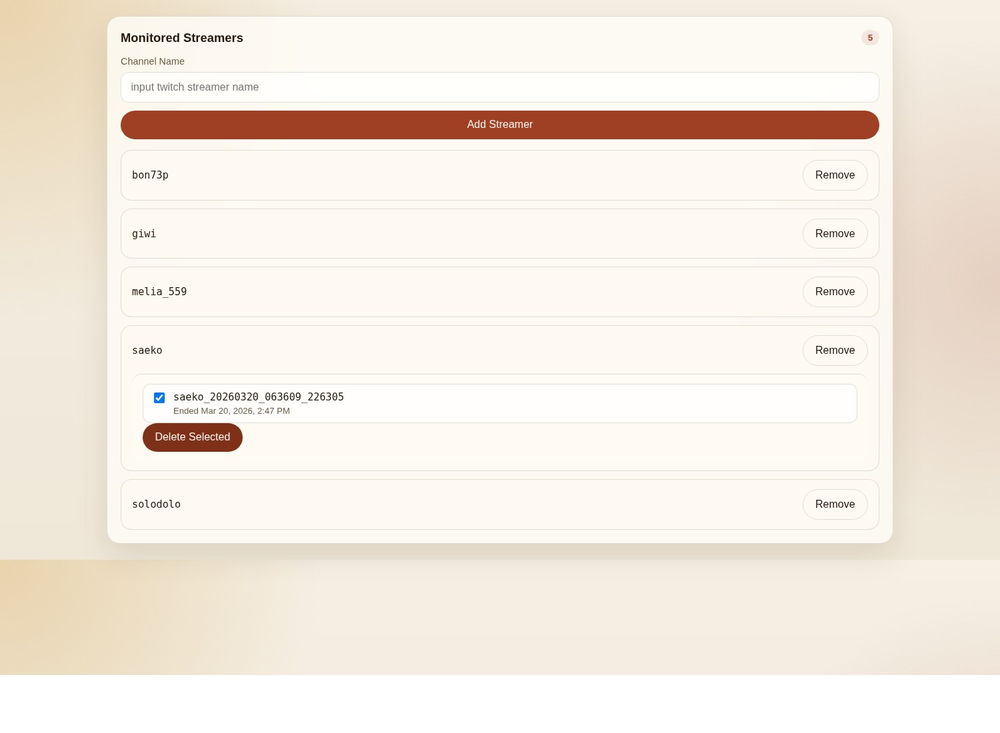
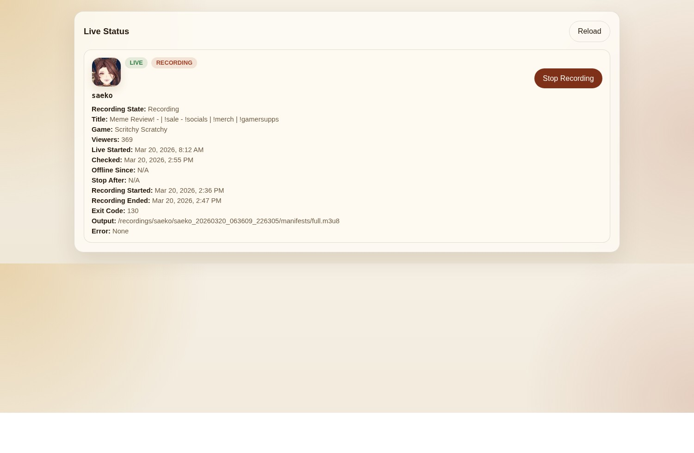
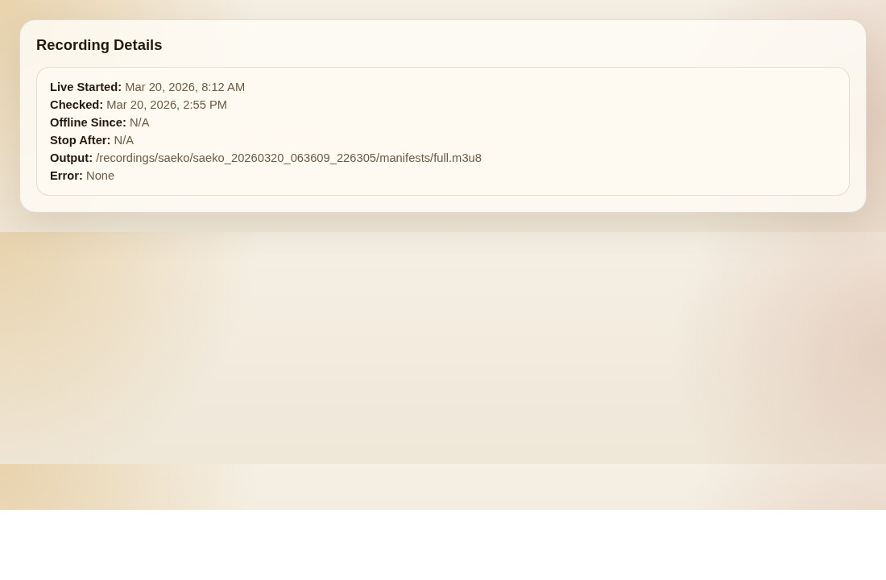
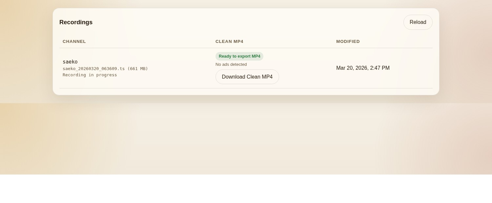

# Twitch Recorder

Chinese users: see [README.md](./README.md).


This project helps you automatically monitor Twitch streamers and start recording as soon as they go live, so you do not have to keep checking stream schedules manually.

It is useful for these situations:

- Automatically save streams from specific Twitch channels
- Track multiple streamers at the same time
- Manage your watch list from a browser
- Avoid manually checking when a stream starts and pressing record yourself
- Keep streams when VODs expire or are limited to subscribers

## What It Can Do

- Add Twitch streamers you want to monitor
- Remove streamers from the management dashboard
- Automatically check whether a streamer is live
- Wait a configurable number of seconds after a stream starts before recording, to avoid the opening `Preparing your stream`
- Keep a short offline grace period before automatically stopping the recording
- Manually start or stop recording while the stream is live
- See who is currently live, who is being recorded, and the current recording status
- View recently recorded files and downloadable clean video outputs

## What You Need Before Starting

- A computer with Docker installed
- A Twitch application key pair
  - `TWITCH_CLIENT_ID`
  - `TWITCH_CLIENT_SECRET`

You can think of these as the credentials that allow this tool to request public stream information from Twitch. Without them, the system does not know which Twitch application it should use to fetch data.

If you do not have them yet, you can apply for them like this:

1. Sign in to your Twitch account
2. Open the Twitch Developer Console
3. Create a new application
4. After it is created, copy the `Client ID`
5. Click the button to generate a new `Client Secret`
6. Put both values into the matching fields in `.env`


If the application form asks for an `OAuth Redirect URL`, you can enter a local address such as `http://localhost`. This project mainly uses the credentials to query stream information, so it does not require a complex login flow.

## Quick Start

1. Create a `.env` file in the project root

Put the following content into it:

```env
TWITCH_CLIENT_ID=your_client_id
TWITCH_CLIENT_SECRET=your_client_secret
TWITCH_USER_OAUTH_TOKEN=
TWITCH_USER_LOGIN=
MAX_CONCURRENT_STREAMERS=3
POLL_INTERVAL_SECONDS=30
OFFLINE_GRACE_PERIOD_SECONDS=20
RECORDING_START_DELAY_SECONDS=25
RECORDINGS_PATH=/recordings
CONFIG_PATH=/config
ALLOWED_ORIGINS=http://localhost:3000,http://127.0.0.1:3000
```

Optional values (the project still works if you leave them empty):

- `TWITCH_USER_OAUTH_TOKEN`: user OAuth token used for authenticated capture to best-effort reduce ads and opening wait screens
- `TWITCH_USER_LOGIN`: optional Twitch account login; if omitted, the system still tries to operate in the token scenario as best it can
- `RECORDING_START_DELAY_SECONDS`: how many seconds to wait after a streamer goes live before starting recording (default: 25 seconds)

2. Start the project

```bash
docker compose up -d --build
```

3. Open your browser

- Dashboard: `http://localhost:3000`

## Daily Usage

1. Open the dashboard
2. Enter the Twitch streamer name you want to monitor
3. Click add, and the streamer will be saved to the watch list
4. The system refreshes stream status automatically based on `POLL_INTERVAL_SECONDS`
5. If the streamer goes live, the system waits for `RECORDING_START_DELAY_SECONDS` and then starts recording automatically
6. You can also click `Start Recording` or `Stop Recording` manually on the live stream card
7. After the streamer goes offline, the system keeps the recording alive for `OFFLINE_GRACE_PERIOD_SECONDS` before stopping
8. Recorded files and related data are saved in the project folders

## What You Can See On The Dashboard

- Header summary: how many channels are recording, live, and being monitored

  

- Watch list: streamer names, and when you click a name you can choose recording directories to delete; deleting removes that entire time-based recording directory

  

- Live cards: avatar, live status, recording status, title, category, viewer count

  

- Recording details: stream start time, last check time, offline time, stop deadline, output path, error message

  

- Recording list: the latest 5 recordings with channel name, file status, and download buttons

  

## Where Recorded Files Are Stored

All recording data is stored under folders in the project root:

- `recordings/<recording_id>/`: one recording session directory
- `recordings/<recording_id>/exports/`: exported video files
- `recordings/<recording_id>/recording.meta.json`: metadata for one recording session
- `config/streamers.json`: monitored streamer list
- `config/recordings.json`: recording history index

## Ad Mitigation (Hybrid Mode)

- Without a user token: recording uses the normal public mode
- With `TWITCH_USER_OAUTH_TOKEN`: the system first tries authenticated capture (best-effort) and falls back automatically if it fails
- While recording, the system detects ad breaks from `streamlink` output; `timed_id3` is treated only as a candidate signal and must be confirmed by localized OCR before it is trusted
- `.meta.json` keeps the `streamlink` process `exit_code` and the last 40 lines of stderr so you can trace reasons such as `playlist ended`, `stream disconnected`, or ad-triggered stream switching

## Common Commands

Start:

```bash
docker compose up -d --build
```

Check running containers:

```bash
docker compose ps
```

View backend logs:

```bash
docker compose logs -f backend
```

Manually refresh container state:

```bash
curl -X POST http://localhost:8000/refresh
```

Stop:

```bash
docker compose down
```
